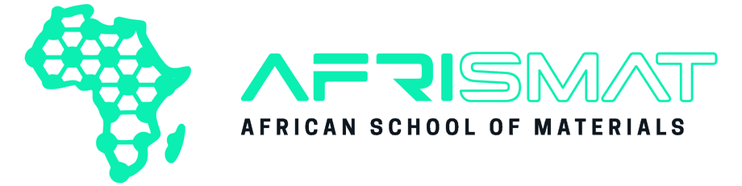
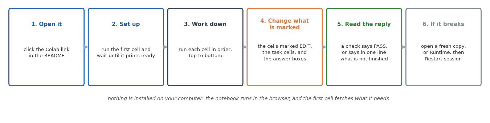

# NMPC: two exercises, no prior programming experience needed

Two exercises on nonlinear model predictive control, for people with no prior
programming experience. The controller is supplied, written with the do-mpc
library, and the work is running it, changing one setting at a time, setting
the goal, and explaining what happens.
Each ends with an optional section where a few short pieces of the controller
are written by hand.

| exercise | files | open in Colab |
| --- | --- | --- |
| 0a: mobile robot | `NMPC_robot_intro.ipynb`, `lib/robot_lab.py`, `lib/common.py` | [open](https://colab.research.google.com/github/JohnEkD/nmpc-intro/blob/main/NMPC_robot_intro.ipynb) |
| 0b: quadrotor | `NMPC_drone_intro.ipynb`, `lib/drone_lab.py`, `lib/common.py` | [open](https://colab.research.google.com/github/JohnEkD/nmpc-intro/blob/main/NMPC_drone_intro.ipynb) |

Take 0a before 0b: it explains the method with a simpler vehicle. 0b adds the
part that makes flying hard, since the rotors can only push, so the vehicle
must tilt before it can move sideways.

Each applies the method to a robot model from the DeepMind MuJoCo Menagerie:
do-mpc and CasADi solve the optimisation, MuJoCo provides the simulated
vehicle.

## How to work through a notebook



## Building the controller yourself

Exercises 1 and 2 build the same controllers line by line, in CasADi, with
every part of the problem written out. They are in a separate repository:
[JohnEkD/nmpc-workshop](https://github.com/JohnEkD/nmpc-workshop).

## Structure

```
NMPC_robot_intro.ipynb      the notebooks: open these
NMPC_drone_intro.ipynb
lib/                        the code the notebooks use: no need to open
videos/                     the videos the notebooks play
```

Each notebook opens with a short video of the finished controller: the MuJoCo
simulation beside the controller's own view. The videos are stored in the
`videos` folder, so they play at once. Keep that folder beside the notebooks
(on GitHub, at the top level of the repository). If it is missing, the
notebook makes the video itself, which takes up to half a minute.

## Running it

**Colab.** Click a link above and run the first cell. It installs what is
needed and downloads the files it needs from `lib/` in this repository.

**Locally.** Clone the repository, then:

    pip install -r requirements.txt
    jupyter lab

`RUNNING.md` has the details for VS Code, Jupyter Lab and Anaconda
(`environment.yml`).
